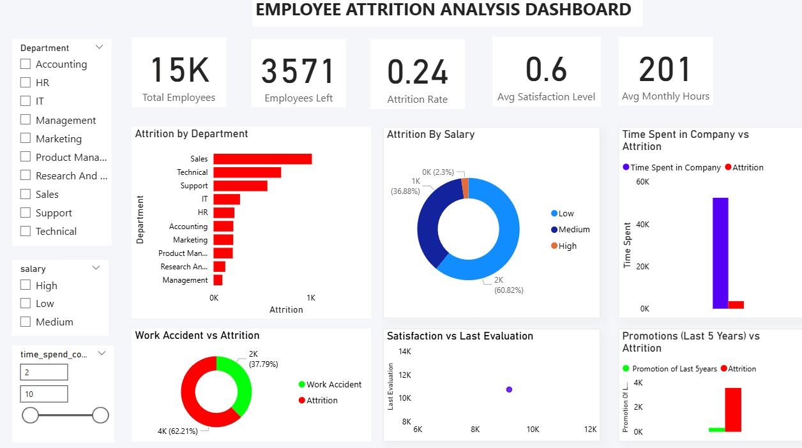

# Employee Attrition Analysis

## 📊 Project Overview
This project analyzes **employee attrition** using both **Exploratory Data Analysis (EDA) in Python** and an **interactive dashboard in Power BI**.  
The goal is to identify key factors influencing employee turnover and provide insights that can help HR make better decisions to improve retention.

---

## 🛠 Tools & Technologies
- **Python (Jupyter Notebook)** – Pandas, NumPy, Matplotlib, Seaborn  
- **Power BI Desktop** – Interactive dashboards & KPIs  
- **Excel/CSV Dataset** – Employee attrition data  
- **DAX** – For calculated measures  

---

## 📌 Project Workflow
1. **EDA (Python - Jupyter Notebook):**
   - Data cleaning and preprocessing  
   - Checked for null/missing values  
   - Univariate & bivariate analysis (histograms, countplots, boxplots)  
   - Identified correlations between features (heatmap)  
   - Key Insights:
     - Employees with lower satisfaction are more likely to leave  
     - High working hours increase attrition risk  
     - Most attrition happens in employees with fewer years at the company  

2. **Dashboard (Power BI):**
   - **KPIs (Cards):**
     - Total Employees  
     - Total Attrition  
     - Attrition Rate (%)  
     - Average Monthly Hours  
   - **Charts/Visuals:**
     - Bar Charts – Attrition by Department/Role  
     - Histogram – Satisfaction level distribution  
     - Line Chart – Average monthly hours vs. years at company  
     - Pie Chart – Attrition distribution across departments  
   - **Insights:**
     - Sales & HR departments have the highest attrition rates  
     - Overworked employees tend to leave more  
     - Clear link between job satisfaction and attrition  

---

## 🎯 Business Impact
- Helps HR identify high-risk departments and roles  
- Provides data-driven insights to improve employee satisfaction  
- Supports policy decisions to reduce attrition and save hiring costs  

---

## 📂 Project Structure
- `Attrition_EDA.ipynb` → Jupyter Notebook with Python EDA  
- `Attrition_Dashboard.pbix` → Power BI Dashboard file  
- `dataset.csv` → Employee attrition dataset  

---

## 🚀 How to Use
1. Open **Jupyter Notebook** (`Attrition_EDA.ipynb`) to explore EDA and findings  
2. Open **Power BI file** (`Attrition_Dashboard.pbix`) for interactive visual analysis  
3. Use slicers and filters in Power BI to explore attrition patterns  

---

## 📷 Dashboard Preview

---

